# Faux-Star Phishing App

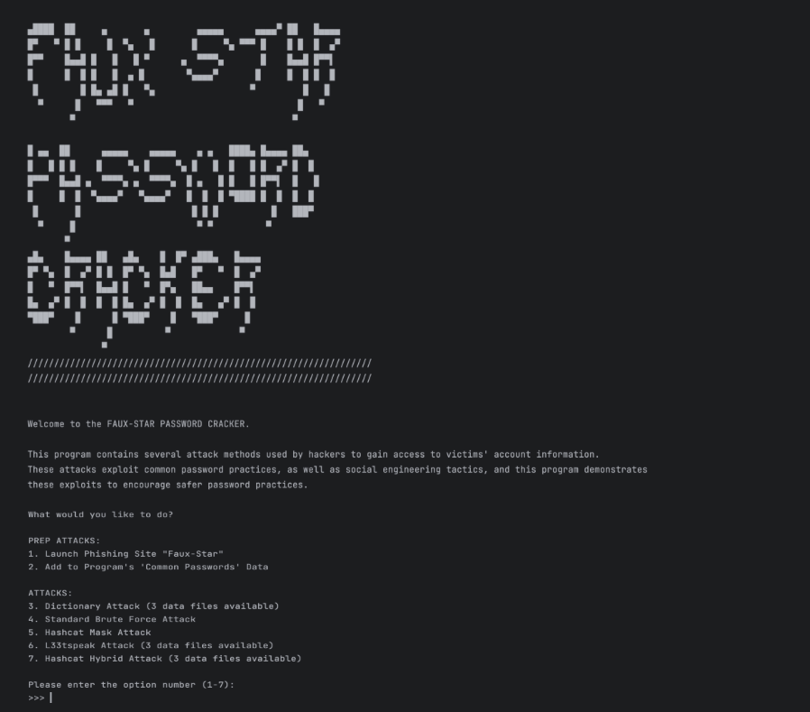

My entry for the CFG Intro to Python MOOC Challenge, August 2023.

I wanted to demonstrate a variety of attacks that hackers can use to breach accounts.

In this program, I demonstrate:

* [Dictionary Attack](#dictionary-attack)
* [Brute Force Attack](#brute-force-atack)
* [Mask Attack, from Hashcat](#hashcat-mask-attack)
* [L33tspeak Attack](#l33tspeak-attack) (modification of Mask Attack)
* [Hybrid Attack](#hybrid-attack)

Notably, I also have a **Phishing Attack**
For this, I created a fake version of the popular astrology social media app `Co-Star`
The phished information on the target's name, birthday, and login details is then transformed into possible combinations and alternative spellings
for a personalised Dictionary Attack.

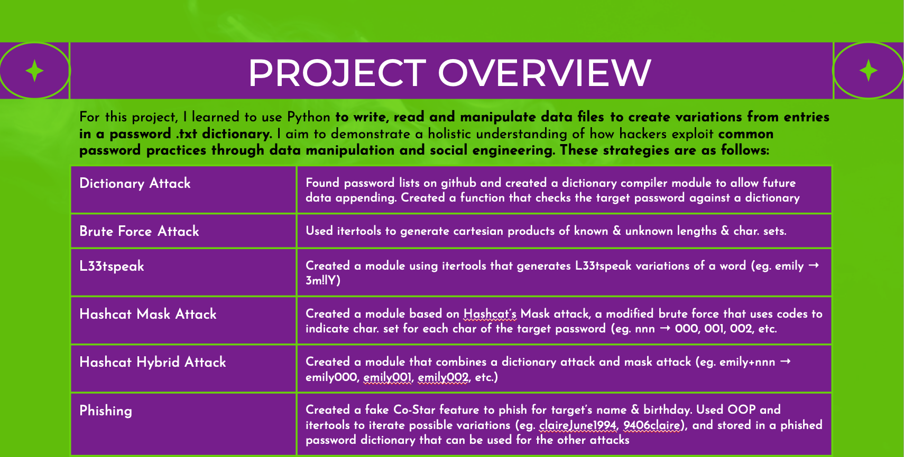

## DICTIONARY ATTACK:

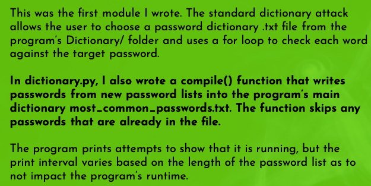
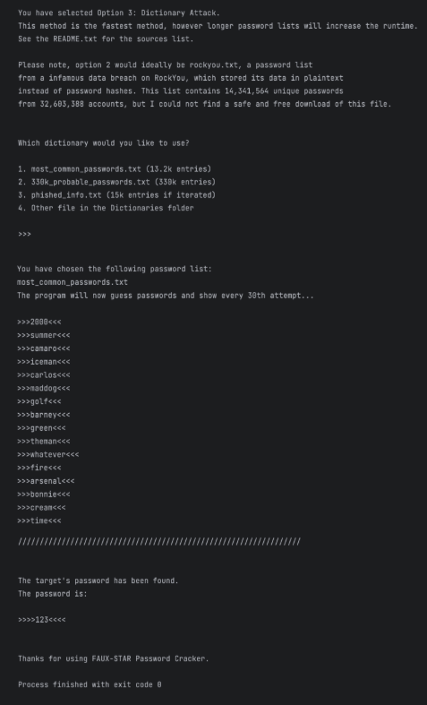

## BRUTE FORCE ATACK:

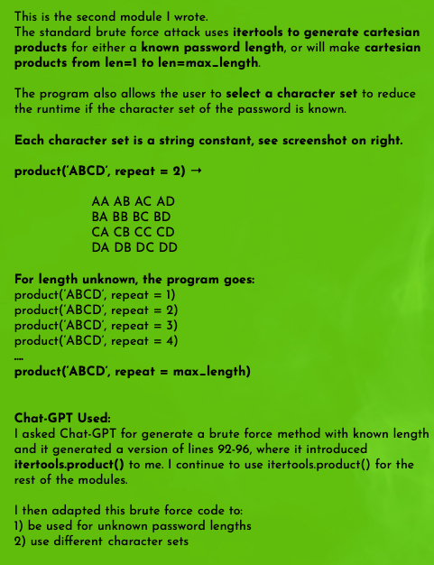
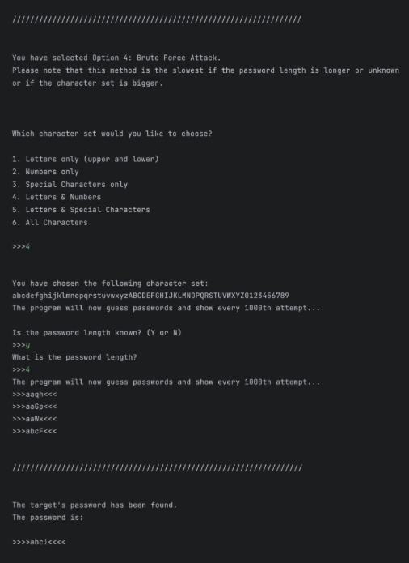

## L33TSPEAK ATTACK:

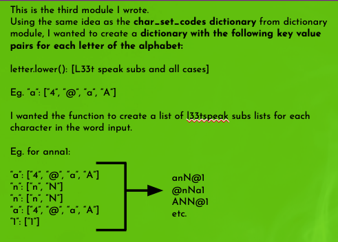
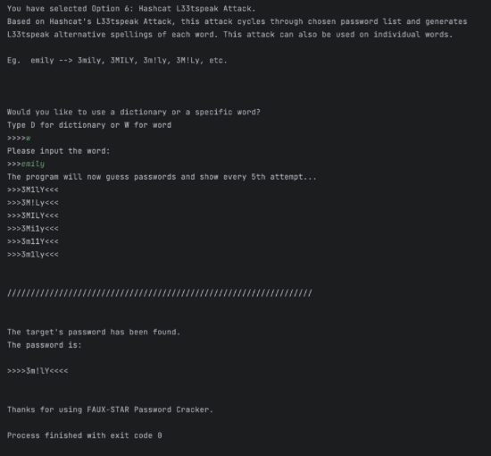

## HASHCAT MASK ATTACK:

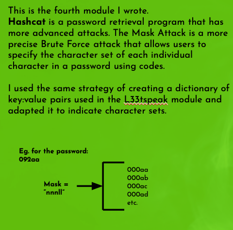
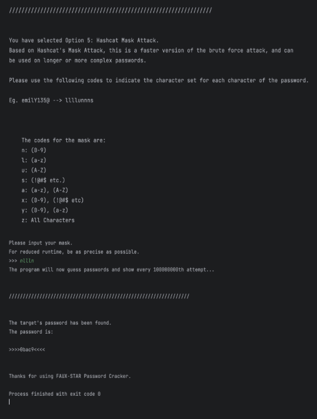

## HYBRID ATTACK:

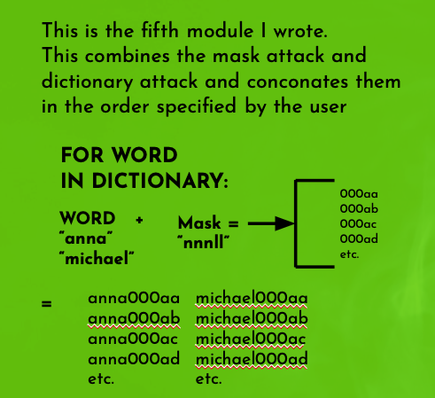
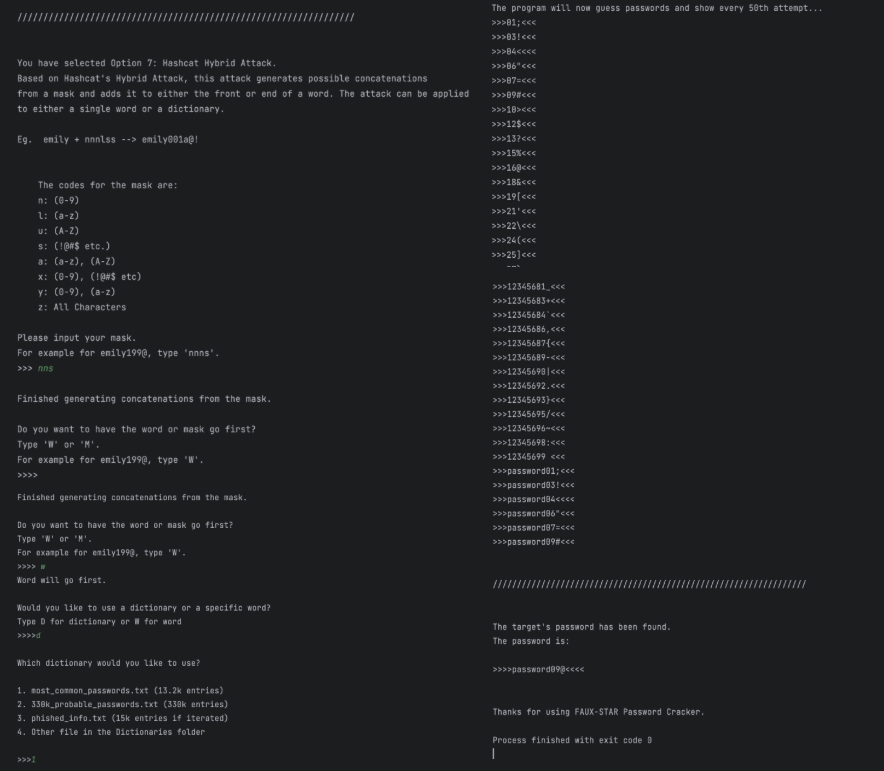

## PHISHING ATTACK:

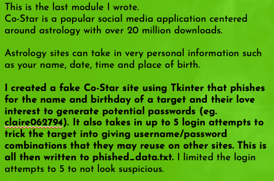

Actual Costar App:
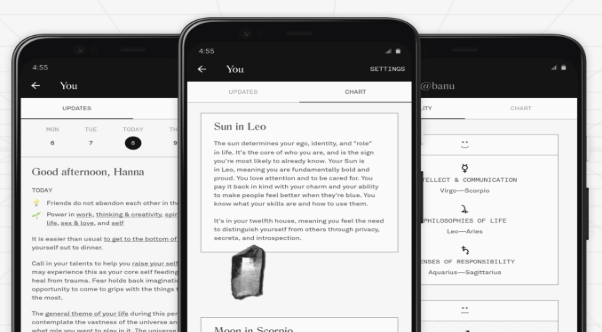

My Phishing App:

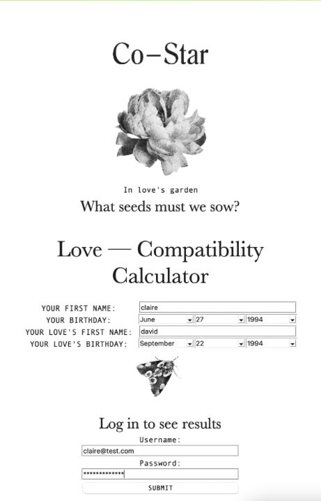
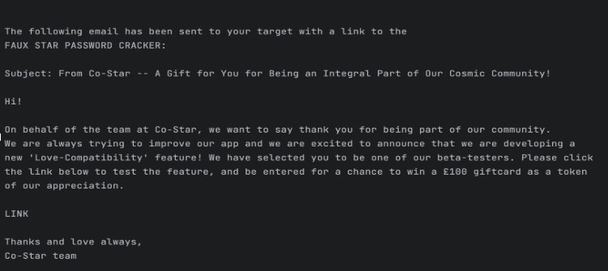

Creating Personalised Dictionary:

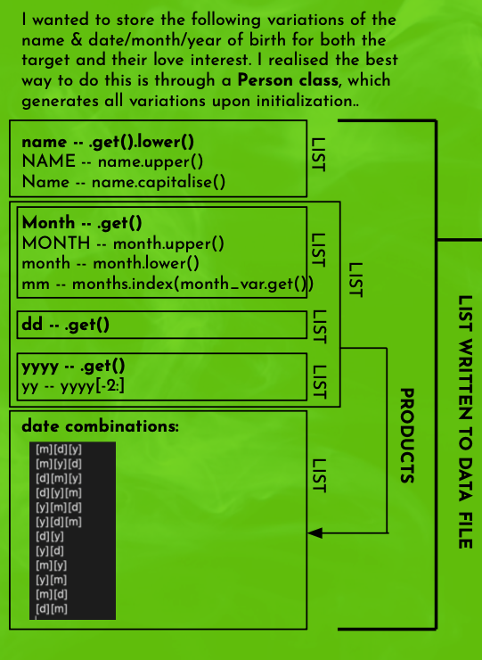

